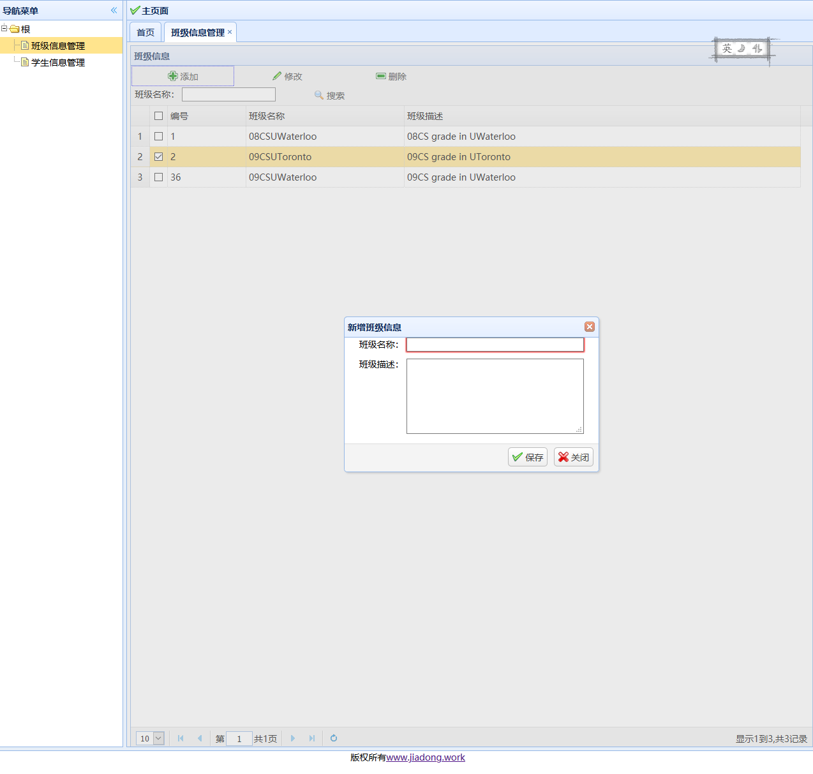

# StudentManageSystem
Front-End: HTML/CSS/JS/EasyUI/AJAX; Back-End: Java/Servlet/Tomcat/XML/JSON/JDBC/dbUtils/MVC 

### Before You Use:
1. SQL password:
username=root
password=password
2. Database Name:
mystudentsys
3. three tables:
- db_user
	- 
- db_grade
	- 
- db_student
	- 

### Basic Introduction
1. Login System

- login System is based on the data in db_user, 用户名=userName 密码=password
- Three Situations
	- userName or password is empty(show 用户名or密码为空)
	- userName and password doesn't match(show 用户名or密码错误)
	- userName and password is correct(login to the main page)

2. Grade CRUD System
- Grade System is based on the data in db_grade
- five situations:
	- List All Grade
	- Search Grade
	- Add Grade
	- Edit Grade
	- Delete Grade

3. Student CRUD System
- Student System is based on the data in db_student
- five situations:
	- List All Student
	- Search Student
	- Add Student
	- Edit Student
	- Delete Student

### Last
Thank you for your watching.
I will keep update more function for this project.

John Mai

